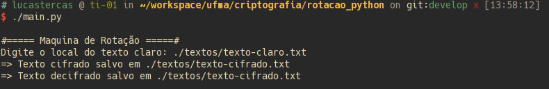

# Cifra de Máquina de Rotação

## Descrição:

Esse algoritmo consistede uma máquina de rotação com 3 rotores, onde a
posição inicial dos rotores é inicializada aleatoriamente.

### Rotores Utilizados:

1. ekmflgdqvzntowyhxuspaibrcj
2. ajdksiruxblhwtmcqgznpyfvoe
3. bdfhjlcprtxvznyeiwgakmusqo

## Cifragem:

A cifragem consiste de um algoritmo bem simples, onde cada letra do texto
claro passa de um rotor para o outro, e a saida para o texto cifrado
é a saida do terceiro rotor.

A saída de um rotor é calculado da seguinte maneira:

1. Calcular a posição a letra de entrada no alfabeto
2. Adicionar a posição do rotor
3. Calcular o módulo disso com 26
4. A saída é a letra no rotor desse índice

```python
alphabet = "abcdefghijklmnopqrstuvwxyz"
output_index = alphabet.index(input) + position
output_index %= 26
output = rotor[output_index]
```

O nome máquina de rotação vem do fato de que a posição dos rotores muda
constantemente, o primeiro rotor sempre avança uma letra a cada vez que
é usado, e os rotores seguintes avançam uma letra sempre que o rotor
anterior fez uma volta completa.

```python
if rotor_index == 0: # O primeiro rotor sempre anda
  rotors_position[rotor_index] = (rotors_positions[rotor_index]+1) % 26
else:
  # Os seguintes só andam se o anterior fez uma volta completa
  if rotors_position[rotor_index-1] == 0:
    rotors_position[rotor_index] = (rotors_positions[rotor_index]+1) % 26
```

## Decifragem:

## Exemplo de Uso:

Para usar o programa, crie um arquivo com o texto claro e execute o programa:

```bash
./main.py
```

O programa irá lhe perguntar onde está o texto claro, digite o local, e o texto cifrado e o decifrado será salvo na mesma pasta do texto claro.


